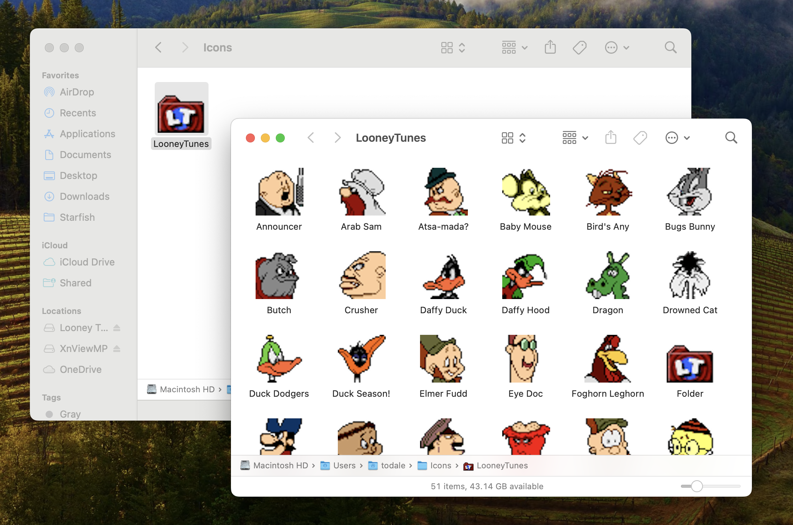
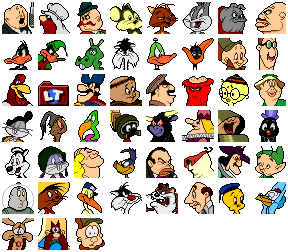

# Mac Icon Grid Generator

Takes a directory containing folders with custom MacOS icons as input and
generates a single PNG with all of those icons in a grid:

From this:



To this:



_[Looney Tunes icons are from The Iconfactory](https://freeware.iconfactory.com/preview/lnyt)_

This is bunch of hacked together shell scripts that combine:

* [ImageMagick 7](https://imagemagick.org/index.php)
* [libicns](https://github.com/kornelski/libicns)

## Installation

<span style="font-weight: bold; font-size: 18px"><span style="color: red">Note:</span> This will only work on MacOS since it relies a file system that supports resource forks. Tested on Sonoma 14.6.1.</span>

Install the dependencies then clone this repo:

```bash
brew install imagemagick
brew install libicns
git clone https://github.com/tomdale/mac-icon-grid-generator.git
cd mac-icon-grid-generator
```

## Scripts

### `./generate`

Generates a grid of icons from a .dmg URL, assuming the icons are located in a
folder named `Icons` (or `icons`, HFS is case insensitive baybeee) at the root of the disk image (i.e. Iconfactory style):

```bash
./generate <NAME> <DMG_URL>

# Example
./generate Expo99 https://freeware.iconfactory.com/assets/expo/download.dmg
```

This will generate two PNGs, one called `<NAME>.png` with the original 32x32 resolution and another called `<NAME>_4x.png` upscaled to 128x128.

### `./extract-dmg`

Downloads a `.dmg` disk image from the provided URL and extracts its contents into the specified directory:

```bash
./extract-dmg <DMG_URL> <OUTPUT_DIR>

# Example
./extract-dmg https://freeware.iconfactory.com/assets/expo/download.dmg Expo99
```

### `./extract-icons`

Given a path to a directory, extracts the custom icon for each folder within
that directory into a PNG file in the specified output directory.

```bash
./extract-icons <INPUT_DIR> <OUTPUT_DIR>

# Example
./extract-icons Expo99/Icons Expo99_pngs
```

The PNGs are named after the folder they are extracted from (e.g.
`Expo99/icons/Yosemite G3` -> `Expo99_pngs/Yosemite G3.png`). The largest resolution from the icns resource is used to generate the PNG, which in all the cases I tested with was 32x32px. YMMV if you try it with bigger icons.

### `./grid`

Given a directory containing multiple icons as PNGs, generates a grid of those icons in a single PNG:

```bash
./grid <INPUT_DIR> <OUTPUT_PNG> [<BGCOLOR>] [<MARGIN>]

# Example
./grid Expo99_pngs Expo99.png
./grid Expo99_pngs Expo99.png white 10
./grid Expo99_pngs Expo99.png pink 17
```

This will generate a grid of the icons in `Expo99_pngs`, in two versions:
`Expo99.png` and a 4x upscaled version at `Expo99_4x.png`. If not specified, the
default background is transparent with 2px margin between icons.

## Sorry

This is a hacky script that I wrote for my own use. If it breaks something,
don't blame me, blame Claude/ChatGPT/GitHub Copilot. I'm just a simple caveman.

_These shell scripts are provided "as is", without warranty of any kind, express
or implied, including but not limited to the warranties of merchantability,
fitness for a particular purpose and noninfringement. In no event shall the
authors or copyright holders be liable for any claim, damages or other
liability, whether in an action of contract, tort or otherwise, arising from,
out of or in connection with the scripts or the use or other dealings in the
scripts._

_Use of these scripts is at your own risk. The authors make no representations or warranties regarding the accuracy, functionality, or performance of these
scripts._

_Before using these scripts, please review them carefully and test in a safe
environment. The user assumes full responsibility for any consequences resulting
from the use of these scripts._

_By using these scripts, you agree to this disclaimer and assume all associated
risks._
